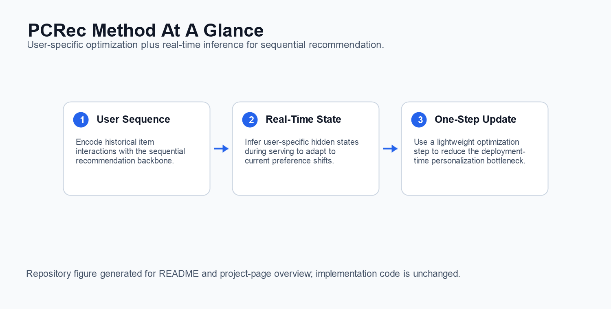

# PCRec

Official implementation for **Breaking the Bottleneck: User-Specific Optimization and Real-Time Inference Integration for Sequential Recommendation**.

[](https://doi.org/10.1145/3711896.3736865)
[](https://ustc-starteam.github.io/PCRec/)

## 1. Paper

Wenjia Xie, Hao Wang, Minghao Fang, Ruize Yu, Wei Guo, Yong Liu, Defu Lian, and Enhong Chen. **Breaking the Bottleneck: User-Specific Optimization and Real-Time Inference Integration for Sequential Recommendation**. In *Proceedings of the 31st ACM SIGKDD Conference on Knowledge Discovery and Data Mining V.2 (KDD 2025)*, pages 3333-3343, Toronto, ON, Canada, 2025.

[Paper](https://doi.org/10.1145/3711896.3736865) / [Project Page](https://ustc-starteam.github.io/PCRec/) / [Citation](#12-citation)

PCRec integrates user-specific optimization with real-time inference for sequential recommendation. The repository contains the PCRec model implementation and the trainer plugin needed to run the method in the generative-recommenders-style training stack.

## 2. Highlights

- Focuses on the deployment bottleneck of per-user adaptation in sequential recommendation.
- Integrates user-specific optimization into real-time inference.
- Provides a PCRec sequential model implementation under `pcrec/modeling/sequential/PCRec.py`.
- Includes a trainer replacement file for the PCRec-simple plugin workflow.

## 3. Method At A Glance



PCRec encodes user histories, performs lightweight user-specific adaptation, and serves recommendations through an inference path designed for real-time use.

## 4. Repository Structure

```text
.
├── pcrec/modeling/sequential/PCRec.py   # PCRec sequential model
├── pcrec/trainer/                       # Trainer components
├── train.py                             # Plugin trainer replacement
├── main.py                              # Training entry adapted from generative-recommenders
└── docs/                                # GitHub Pages project page
```

## 5. Installation

PCRec follows the generative-recommenders environment. Install PyTorch and the dependencies required by the upstream training stack, then place this repository's PCRec files into the working tree used for experiments.

## 6. Data / Models

Use the same public sequential recommendation data preparation as the underlying generative-recommenders setup. The PCRec-specific code is model and trainer logic; dataset preparation remains in the host training stack.

## 7. Quick Start

For the plugin corresponding to PCRec-simple, replace:

```text
generative-recommenders-main/generative_recommenders/trainer/train.py
```

with this repository's root-level `train.py`.

Then run the training entry with the target config used by your generative-recommenders experiment:

```bash
python main.py --gin_config_file=PATH_TO_CONFIG.gin --master_port=12345
```

## 8. Reproducing Results

The paper's reproduced setting depends on the host generative-recommenders configuration, dataset preprocessing, and GPU environment. Keep the trainer replacement and PCRec model code synchronized when reproducing the KDD 2025 experiments.

## 9. Configuration Notes

- `pcrec/modeling/sequential/PCRec.py` implements the PCRec sequence encoder.
- The root `train.py` is intended as the trainer replacement mentioned in the original README.
- The code imports the upstream `generative_recommenders` package, so run it inside a compatible checkout or environment.

## 10. Experimental Highlights

PCRec targets the inference-time cost of user-specific optimization. The method is designed for sequential recommendation scenarios where personalization must happen quickly.

| Reproducible setting in this repository | Evidence exposed by the release |
| --- | --- |
| Logged ranking metrics | The trainer reports `NDCG@10`, `HR@10`, `HR@50`, and `MRR` during evaluation. |
| Full evaluation output | The evaluation code can log `NDCG@1/10/50/100/200`, `HR@1/10/50/100/200/500/1000`, and `MRR`. |
| Integration boundary | PCRec separates model code from the trainer plugin, making it easier to integrate with existing generative-recommendation pipelines. |
| Practical target | The repository focuses on reducing personalization overhead at inference time rather than changing dataset preprocessing. |

The ACM-hosted KDD paper tables are not mirrored in this repository and the publisher PDF was not directly accessible during this pass, so exact benchmark scores are intentionally not restated here. Add the numeric table once an accessible official source or released result artifact is available.

**Conclusion:** the current README can document the evaluation surface and personalization objective reliably, while avoiding unsupported numeric claims.

## 11. Notes For Maintainers

- Keep the original plugin instruction visible because it is the most important setup step for users.
- Avoid moving `train.py` without updating this README and the project page.
- If a standalone config is added later, place it under a stable `configs/` path and update the Quick Start section.

## 12. Citation

If you find this repository useful, please cite:

```bibtex
@inproceedings{xie2025breaking,
  title={Breaking the Bottleneck: User-Specific Optimization and Real-Time Inference Integration for Sequential Recommendation},
  author={Xie, Wenjia and Wang, Hao and Fang, Minghao and Yu, Ruize and Guo, Wei and Liu, Yong and Lian, Defu and Chen, Enhong},
  booktitle={Proceedings of the 31st ACM SIGKDD Conference on Knowledge Discovery and Data Mining V.2},
  pages={3333--3343},
  year={2025},
  doi={10.1145/3711896.3736865}
}
```

## 13. Contact

- First author: Wenjia Xie (no verified public email found from accessible paper sources).
- Repository questions: please open a GitHub issue in this repository.
